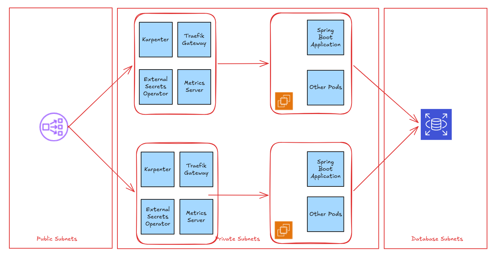

# Spring PetClinic REST - DevOps Edition

This repository is a fork of the official [Spring PetClinic REST project](https://github.com/spring-petclinic/spring-petclinic-rest). While the core application remains the classic Spring Boot REST API for managing a veterinary clinic, this fork focuses on adding a complete **DevOps lifecycle** to the project.

## 🏗️ Architecture & Diagram

Below is the high-level diagram illustrating how the application, infrastructure, and deployment pipelines connect:




## 🔗 Related Repositories

This project is part of a larger microservices/DevOps ecosystem. You can access the configuration and deployment code here:

* **Infrastructure:** https://github.com/alanpham2k2/infra
* **Deployment:** https://github.com/alanpham2k2/helm

## 🚀 What's Added (The DevOps Part)

* **Containerization:** `Dockerfile` added for building lightweight, production-ready application images.
* **CI/CD Pipeline:** Automated workflows (GitHub Actions) for testing, building, and pushing the Docker image.
* **Helm Charts:** Kubernetes deployment manifests managed via Helm (see the Deployment repo linked above).
* **Infrastructure as Code (IaC):** Use Terraform to set up the underlying environment (see the Infrastructure repo linked above).

## 💻 Local Development

If you want to test the containerized version locally:

```bash
git clone https://github.com/alanpham2k2/app
cd app
docker compose up
```


